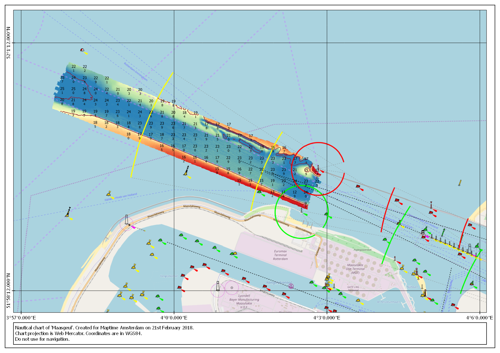

# Maptime #18 - Finding your way at sea
This tutorial is part of the Maptime workshop "Finding you way at sea".

Goal:
*   Create a chart of the 'Maasgeul', which is the entrance to the port of Rotterdam.
*   The chart should display coordinates in WGs84.
*   The chart should use the Mercator projection

Requirements:
*   QGIS 2.18 (earlier versions may work, but are not tested)
*   ["Raw" data](https://we.tl/AtLhqlMDUW) for step 3

---

1.  Open QGIS and create a new project. Make sure the Coordinate Reference System
    (CRS) of the project is set to EPSG:3857.

2.  We will use OpenStreetMap and [OpenSeaMap](http://www.openseamap.org) for the
    background of our chart. Open in QGIS your Browser Panel and add the following
    two URL's to the Tile Server (XYZ). After that you can just drag and drop them
    to the Layer Panel. Just make sure that OpenSeaMap is on top of OpenStreetMap.
    ```
    https://a.tile.openstreetmap.org/{z}/{x}/{y}.png
    http://tiles.openseamap.org/seamark/{z}/{x}/{y}.png
    ```

3.  Add the raw data. When asked at the end about the CRS of the file, choose
    EPSG:25831. The raw data is a csv file with on each line a coordinate and a
    depth. See also the example below. Rename the layer to *raw_data*

    ```
    x,y,z
    566278.50,5763264.50,22.43
    566279.50,5763264.50,22.48
    566280.50,5763264.50,22.50
    ```
    > Normally the raw data is a point cloud, but to reduce file size and avoid
    > performance problems we now use an already gridded point cloud. For the
    > rest of this tutorial we will treat it as it is a point cloud.

4.  Create a virtual layer. We will add a SQL query to make a grid from the
    raw data. We do this by going in the menu to *Layer > Add Layer > Add/Edit
    Virtual Layer...*  
    Now add the following SQL query. After pressing OK it may take 1 or 2 minutes
    depending on the speed of your laptop.

    ```sql
    WITH subquery AS
        (SELECT
            (floor(x/25) * 25) + 12.5 as x,
            (floor(y/25) * 25) + 12.5 as y,
            z FROM raw_data
        )
    SELECT
        x,
        y,
        round(avg(z), 1) AS average_z,
        round(max(z), 1) AS max_z,
        round(min(z), 1) AS min_z,
        round(stddev_pop(z), 2) AS sd,
        ST_Point(x, y) AS geometry
    FROM
        subquery
    GROUP BY
        x, y
    ```

    > The WITH clause is a subquery we use to bring all points within a square of
    > 25 meters back to the center of that square. Of this bunch of points we then
    > SELECT the coordinate, average depth, minimal depth, maximum depth, standard
    > deviation and the geometry.

    You can play around with different grid sizes. You can for example create a
    1x1m grid for displaying bathymetric colours (use red for shallow soundings),
    a 10x10m grid for making contours and 25x25m or higher for labels of the depth
    (remember: a captain is not interested in mean depths, but in minimal depths).

5.  Save the virtual layer as a shapefile. Right click on the virtual layer in
    the Layer Panel and choose *Save As*. After saving you can turn of or delete
    the virtual layer.

6.  This step is optional. Depending on what you want to show in your chart you
    may want to convert the shapefile to a raster. You can do this by going to
    *Raster > Conversion > Rasterize (Vector to Raster)...*  
    Choose a file name and make sure your raster size get the same resolution as
    you used in the SQL query.

7.  If you want to create depth contours you can do so by going to *Raster >
    Extraction > Contour...*

8.  You know now how to make different grids for different purposes (colours,
    contours, labels). Play around with styling all the layers and create with
    the map composer your own nautical chart.

9.  Save your chart and upload it to the Meetup [Photo Album](https://www.meetup.com/Maptime-AMS/photos/upload/?photoAlbumId=28556445)

    
